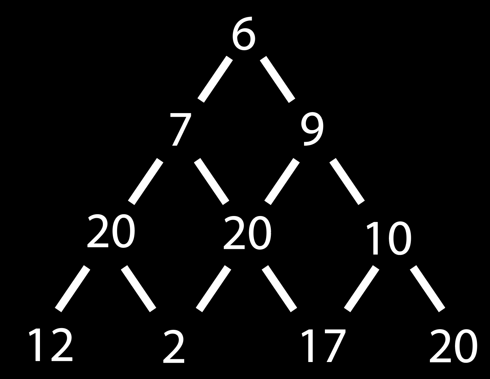
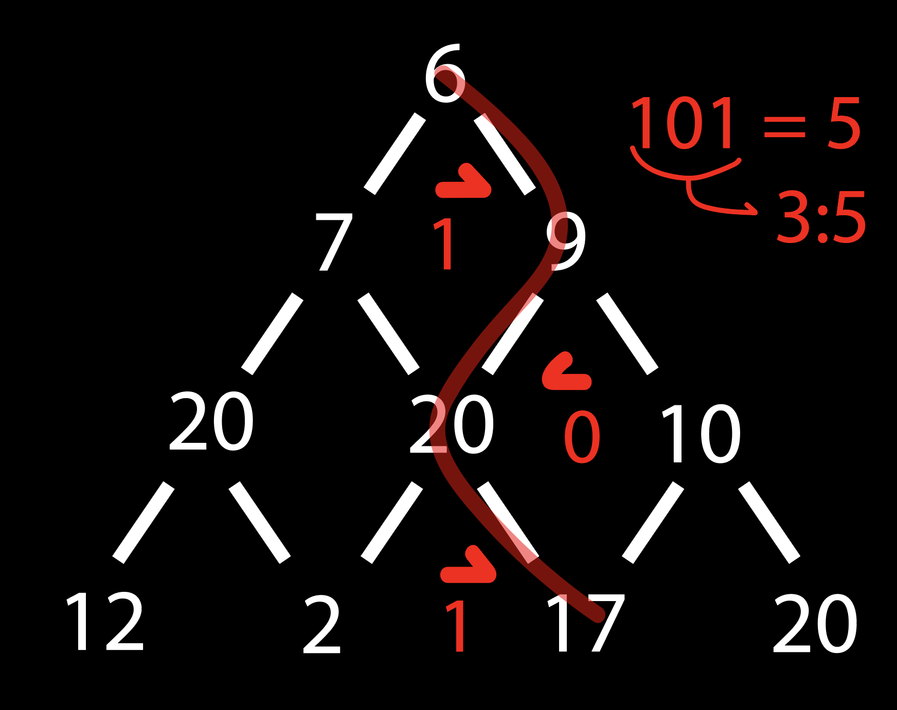
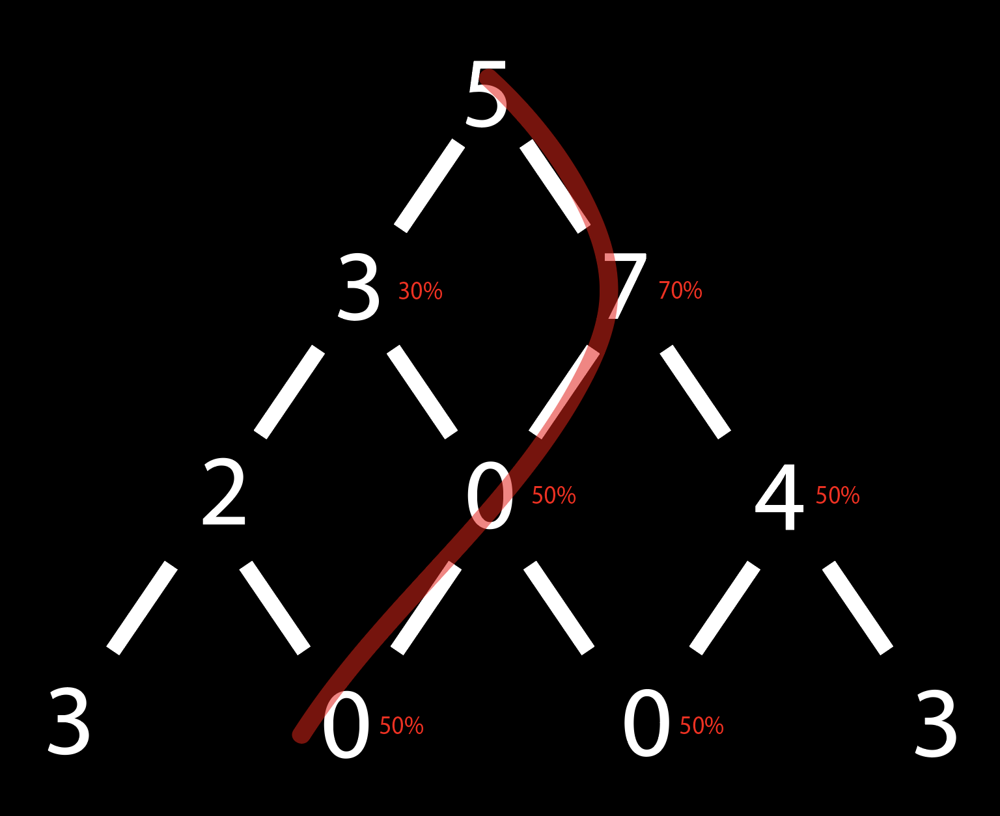
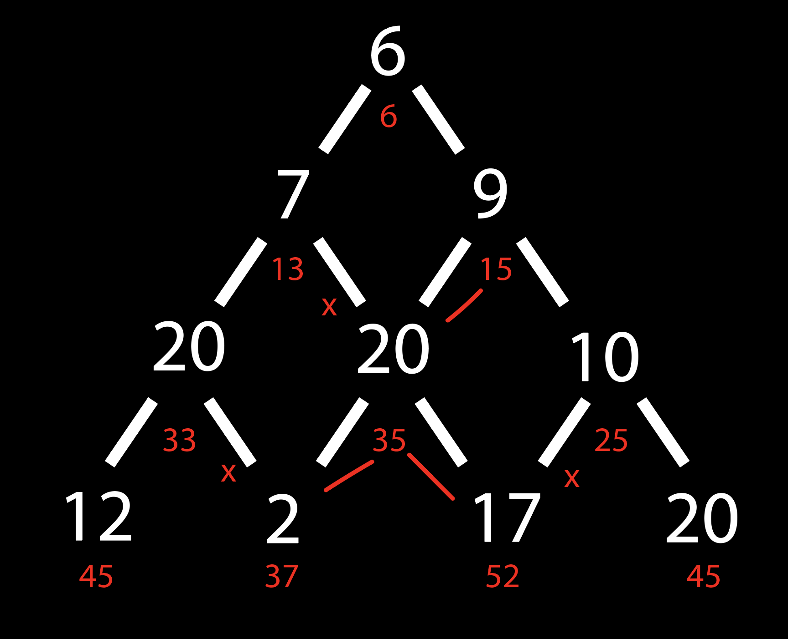
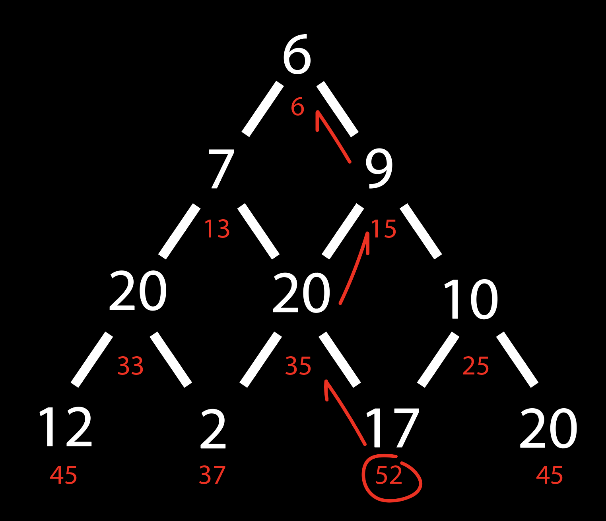

# HiveMind
A machine learning algorithm inspired by the concept of dispersed intelligence as portrayed by Adrian Tchaikovsky.

---
## The Hive
### To be a bee
As an individual, the bee is a simple creature.
It darts off to the nearest flower and feeds on its nectar,
then goes on to the next and repeats.
It does not know the dangers that lie ahead. 
Some flowers are safer than others, but for the bee,
any could be the last. 
It lands on a new one, thus taking another risk... 
Could this be the end? 
Will it ever reach the other side of the meadow?

### The Collectiveness
The mind is the center of information.
It digests, it adapts, it evolves. 
It is every bee that has ever been,
it is every bee that will ever be.
It has experienced death a million times,
and will experience a million more,
but is it ever enough? 
Daniel Whitehall believed that "discovery requires experimentation".
The death of a bee is the birth of another.
And each descendant learns from its ancestors.
Each generation a little smarter than the previous.
### The Mutual Goal
The meadow has many flowers. There are many paths that lead to the other side. Which path is the safest? 
In this particular meadow there are 633 825 300 114 114 700 748 351 602 688 paths. If you could evaluate the safety of 1 000 000 000 000 of them every second, it would still take you 20 084 711 768 years and an extra 281 days to find the best one. By teaching the hive to find a safe path, instead of trying each of them, you trade accuracy with time. And although the result is less reliable, the solution comes faster, and the process is more enjoyable.

---
## A dive into the logic
[The meadow](Tests/input2.txt) is triangular, and each flower has a value from 0 to 20 indicating its safety level. 
*(A safety level of 0 does not equal to an invetiable death, but a survivability chance of 1/21. This is to prevent paths from being completely unusable)*

A bee starts at the top of the triangle and descends down. With each step downwards it has to choose wether to fly to the right or the left diagonally adjacent flower.

The goal is to find the safest path from the top of the triangle to the bottom. 
To do this [The Collectiveness](The_Collectiveness.py) sends out millions of [bees](Hive.py). Each bee flies randomly throught the maze, and when it dies (or reaches the end) it appends the **distance** it travelled and the **path** it took to an `output.csv` file.
* The **path** is an integer representing a binary number with a length equal to the **distance**. Each digit in the binary version of the path corresponds to the directions the bee chose. 0 = left, 1 = right. If the length of the binary path is less than the **distance**, the missing length gets added as zeros in front of the binary path.
* The values get saved as `distance:path,` on one single comma-separated line in the `output.csv` file.

After the first generation of bees are done exploring, The Collectiveness generates an `evaluation.csv` file based on the `output.csv` file. The evaluation looks very similar to [the meadow](Tests/input2.txt), but instead of the numbers representing safety levels, the numbers represent the average distance a bee travelled by choosing said flower. 
The next generation of bees uses the `evaluation.csv` file as reference for which path to choose.
- If at least on of the flowers is unexplored (average distance is zero), the bee will choose its next step randomly.
- If both flowers have an average distance above zero, the bee chooses its next step based on the average distance of each flower. The choice is still random, but uses the average distance as weight for the randomness.

The program is multithreaded, thus utilising all cores of the CPU.

---
## Alternative Solution
This was originally a school assignment, and although very innefficient, that was my solution for it. There is a better solution however, not as interesting to watch, but *a lot* faster.
This alternative solution goes through each flower on every row and finds the best path to each from the previous row.
Here is a visualisation of the process:

